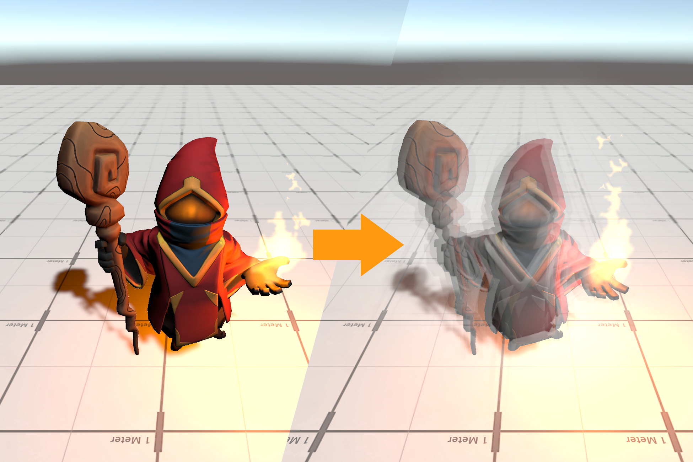

# Wraith Field

Witcher 3 inspired wraith effect in Unity using Shader Graphs

### Pros: 
 - Do not requires geometry shader
 - Is a "warp field" that you can move around, instead of only attached to a model.
 - Use Shader Graphs -> customizable for artists
### Cons:
 - Opaque objects only
 - Requires copying of opaque buffer -> can be expensive on some GPUs
 - Minimal customer support
